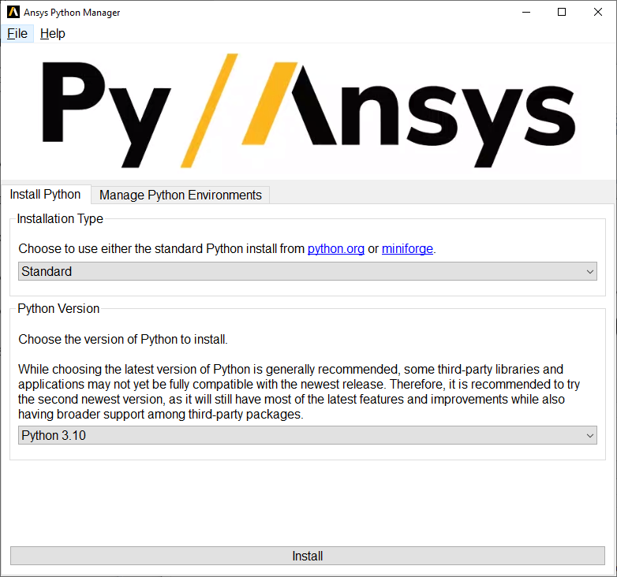

Ansys Python Manager (QT)
=========================

|pyansys| |GH-CI| |MIT| |black| |pre-commit-ci|

.. |pyansys| image:: https://img.shields.io/badge/Py-Ansys-ffc107.svg?logo=data:image/png;base64,iVBORw0KGgoAAAANSUhEUgAAABAAAAAQCAIAAACQkWg2AAABDklEQVQ4jWNgoDfg5mD8vE7q/3bpVyskbW0sMRUwofHD7Dh5OBkZGBgW7/3W2tZpa2tLQEOyOzeEsfumlK2tbVpaGj4N6jIs1lpsDAwMJ278sveMY2BgCA0NFRISwqkhyQ1q/Nyd3zg4OBgYGNjZ2ePi4rB5loGBhZnhxTLJ/9ulv26Q4uVk1NXV/f///////69du4Zdg78lx//t0v+3S88rFISInD59GqIH2esIJ8G9O2/XVwhjzpw5EAam1xkkBJn/bJX+v1365hxxuCAfH9+3b9/+////48cPuNehNsS7cDEzMTAwMMzb+Q2u4dOnT2vWrMHu9ZtzxP9vl/69RVpCkBlZ3N7enoDXBwEAAA+YYitOilMVAAAAAElFTkSuQmCC
   :target: https://docs.pyansys.com/
   :alt: PyAnsys

.. |GH-CI| image:: https://github.com/pyansys/python-installer-qt-gui/actions/workflows/ci_cd.yml/badge.svg
   :target: https://github.com/pyansys/python-installer-qt-gui/actions/workflows/ci_cd.yml
   :alt: GH-CI

.. |MIT| image:: https://img.shields.io/badge/License-MIT-yellow.svg
   :target: https://opensource.org/licenses/MIT
   :alt: MIT

.. |black| image:: https://img.shields.io/badge/code%20style-black-000000.svg?style=flat
   :target: https://github.com/psf/black
   :alt: Black

.. |pre-commit-ci| image:: https://results.pre-commit.ci/badge/github/pyansys/python-installer-qt-gui/main.svg
   :target: https://results.pre-commit.ci/latest/github/pyansys/python-installer-qt-gui/main
   :alt: pre-commit.ci status

This is a simple cross-platform `QT <https://www.qt.io/>`_ application
you can use to install Python and (optional) PyAnsys packages.

.. contribute_start

Installation
~~~~~~~~~~~~
Visit the `Releases
<https://github.com/pyansys/python-installer-qt-gui/releases>`__ page and pull
down the latest installer. This is a simple application you can use to install
Python and manage your Python environment.

For developers
^^^^^^^^^^^^^^
You can be up and running with four lines of code:

.. code:: bash

   git clone https://github.com/pyansys/python-installer-qt-gui
   cd python-installer-qt-gui
   pip install pip -U
   pip install -e .

Now you can run it with:

.. code:: bash

   ansys_python_installer

**Details**

Installing Pytools installer in developer mode allows you to modify the source
and enhance it.

Before contributing to the project, please refer to the `PyAnsys Developer's
guide`_. You will need to follow these steps:

#. Start by cloning this repository:

   .. code:: bash

      git clone https://github.com/pyansys/python-installer-qt-gui

#. Create a fresh-clean Python environment and activate it. Refer to the
   official `venv`_ documentation if you require further information:

   .. code:: bash

      # Create a virtual environment
      python -m venv .venv

      # Activate it in a POSIX system
      source .venv/bin/activate

      # Activate it in Windows CMD environment
      .venv\Scripts\activate.bat

      # Activate it in Windows Powershell
      .venv\Scripts\Activate.ps1

#. Make sure you have the latest version of `pip`_:

   .. code:: bash

      python -m pip install -U pip

#. Install the project in editable mode:

   .. code:: bash

      python -m pip install -e .[tests,doc]

#. Finally, verify your development installation by running:

   .. code:: bash

      pytest tests -v

Style and testing
-----------------
This project uses `pre-commit <https://pre-commit.com/>`_. Install with:

.. code::

   pip install pre-commit
   pre-commit install

This will now run ``pre-commit`` for each commit to ensure you follow project
style guidelines. For example:

.. code::

   git commit -am 'fix style'
   isort....................................................................Passed
   black....................................................................Passed
   blacken-docs.............................................................Passed
   flake8...................................................................Passed
   codespell................................................................Passed
   pydocstyle...............................................................Passed
   check for merge conflicts................................................Passed
   debug statements (python)................................................Passed
   check yaml...............................................................Passed
   trim trailing whitespace.................................................Passed
   Validate GitHub Workflows................................................Passed

If you need to run it again on all files and not just staged files, run:

.. code::

   pre-commit run --all-files

Local build
-----------
This application can be deployed as a 'frozen' application using `pyinstaller
<https://pypi.org/project/pyinstaller/>`_ with:

.. code::

   pip install -e .[freeze]
   pyinstaller frozen.spec

This will generate application files at ``dist/ansys_python_manager`` and you
can run it locally by executing ``Ansys Python Manager.exe``.

Documentation
-------------
For building documentation, you can either run the usual rules provided in the
`Sphinx`_ Makefile, such us:

.. code:: bash

    pip install -e .[doc]
    make -C doc/ html

    # subsequently open the documentation with (under Linux):
    <your_browser_name> doc/html/index.html

Distributing
------------
This project is vectored to be an open-source project. For the time being, feel
free to distribute it internally, but direct users to visit the `Releases
<https://github.com/pyansys/python-installer-qt-gui/releases>`__ page

.. LINKS AND REFERENCES
.. _black: https://github.com/psf/black
.. _flake8: https://flake8.pycqa.org/en/latest/
.. _isort: https://github.com/PyCQA/isort
.. _PyAnsys Developer's guide: https://dev.docs.pyansys.com/
.. _pre-commit: https://pre-commit.com/
.. _pytest: https://docs.pytest.org/en/stable/
.. _Sphinx: https://www.sphinx-doc.org/en/master/
.. _pip: https://pypi.org/project/pip/
.. _tox: https://tox.wiki/
.. _venv: https://docs.python.org/3/library/venv.html
