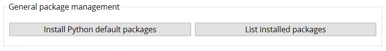

# Supercharge Your PyAnsys Development with the Ansys Python Manager

# Introduction
Python has emerged as a leading language for a diverse range of applications, encompassing data science, machine learning, web development, and workflow automation. PyAnsys is a set of Python package that aligns with this trend, offering a Pythonic interface to Ansys Products. It serves as a powerful tool for automating engineering workflows, conducting parametric studies, and post-processing simulation results, among other applications. However, configuring Python environments and handling dependencies can occasionally prove to be daunting. This is where Ansys Python Manager comes to play.

# What is Ansys Python Manager?
The Ansys Python Manager is a collaborative open-source Python QT application developed by various groups within Ansys. This efficient tool has garnered significant popularity and received positive feedback for its capability to streamline Python usage, simplify virtual environment management, and facilitate PyAnsys packages administration.

In this article, we will delve into the various features offered by the Ansys Python Manager, such as Python installation, creation and management of virtual environments, and the available ways to initiate Integrated Development Environments (IDEs) & Development environments. We will also explore the package management capabilities of the Ansys Python Manager, including the installation of PyAnsys packages and the management of dependencies. Finally, we will discuss the documentation access provided by the Ansys Python Manager and the available options for updating the application.

# Installation
To install the Ansys Python Manager, you can visit its [repository](https://github.com/ansys/python-installer-qt-gui/releases) and download the installer from the latest release (`Ansys-Python-Manager-Setup-v*.exe`) from the Assets section. After downloading the installer, simply run it and follow the installation instructions to install the Ansys Python Manager on your machine. Once the installation is complete, you can easily launch the Ansys Python Manager from the Start Menu.

## Install Python with Ansys Python Manager
The Ansys Python Manager offers a user-friendly interface for Python installation. You can easily select the desired Python version from the provided drop-down menu. The manager provides two options: Standard Python and Condaforge Python. The Standard Python option represents the official Python distribution, while the Condaforge Python option is a community-driven distribution. Users familiar with the Condaforge ecosystem are encouraged to choose the Condaforge Python option.

After selecting the desired Python version and clicking the Install button in the Ansys Python Manager, the application will proceed to download and install the chosen Python distribution. The installation process may take a few minutes to complete. Once the installation is finished, the Ansys Python Manager will display the installed Python version and its corresponding installation path in the next tab labeled "Create Virtual Environments."

  

## Create Virtual Environments
The "Create Virtual Environments" tab in the Ansys Python Manager provides the interface for creating and managing virtual environments. You can easily create a virtual environment by selecting the desired Python version and providing a name for the environment. Simply click the Create button to initiate the virtual environment creation process. The Ansys Python Manager will create the virtual environment and display its corresponding path in the subsequent tab labeled "Manage Virtual Environments."

  

## Manage Virtual Environments
The "Manage Virtual Environments" tab in the Ansys Python Manager allows you to effectively manage the virtual environments you have created. You have options available, such as deleting a virtual environment, Launch Options, General Package Management, and PyAnsys Package Management for the selected virtual environment. You can also delete a virtual environment by selecting it from the available list under "Available virtual environments" and clicking on the "Delete virtual environment" option available with context menu.

  

`Launch options` provides the option to launch the selected virtual environment with the available IDEs and development environments. For example, you can launch the Spyder IDE by selecting the virtual environment from the available list and clicking on the `Launch Spyder` option. Likewise, you can launch the Jupyter Notebook, Jupyter Lab and console.

  

>**Tip:** By using `Launch console` option, you can launch the virtual environment in the command prompt and subsequently navigate to the development folder and launch the VS Code IDEs using command line option "`code .`" And set the interpreter to the virtual environment.

## General Package Management
In the "General Package Management" section, users are presented with the choice to "install default packages." By opting for this selection, the chosen Python installation or virtual environment will receive the most up-to-date compatible versions of essential packages such as `numpy`, `scipy`, `pandas`, `matplotlib`, and `scikit-learn`. After the installation process concludes, users can view the list of installed packages by clicking the `List Installed Packages` button. The Ansys Python Manager will then display the installed packages in the console, providing an overview of the installed dependencies.

  

In the "PyAnsys Package Management" section, there is flexibility to choose the PyAnsys metapackage and its version to install it within the selected Python installation or virtual environment. By selecting the desired PyAnsys metapackage version from the available drop-down menu, users can proceed to install it by clicking the Install button. The Ansys Python Manager will then initiate the download and installation process of the PyAnsys metapackage. Individual PyAnsys packages are also available for download. It is important to note that the installation process may take a few minutes to complete, depending on the size of the package and the internet bandwidth.

  

To ensure that you have the latest version of the Ansys Python Manager, you can easily check for updates by clicking on the "Check for Updates" option located in the File menu. The Ansys Python Manager will then verify if a newer version is available and update accordingly if necessary.

In addition, the Ansys Python Manager offers convenient access to the `PyAnsys documentation` through the Help menu. By selecting your desired PyAnsys project from the provided drop-down menu and clicking on `Open Website`, user will be redirected to the documentation website specifically to the selected project. This enables you to access comprehensive documentation and resources for your chosen PyAnsys project.

  

## Conclusion
In this comprehensive article, we have explored the wide range of features offered by the impressive Ansys Python Manager. This robust tool provides a user-friendly interface for effortless Python installation, efficient creation and management of virtual environments, and seamless installation of PyAnsys packages. Moreover, it offers multiple options for launching your virtual environment in various IDEs and development environments. By harnessing the power of the "Ansys Python Manager," you can streamline your Python development workflow. So, what are you waiting for? Download the Ansys Python Manager and supercharge your PyAnsys development today!

## References
- [Ansys Python Manager Releases](https://github.com/ansys/python-installer-qt-gui/releases)
- [Ansys Python Manager GitHub Repository](https://github.com/ansys/python-installer-qt-gui)
- [Ansys Python Manager Documentation](https://installer.docs.pyansys.com/version/stable/)
